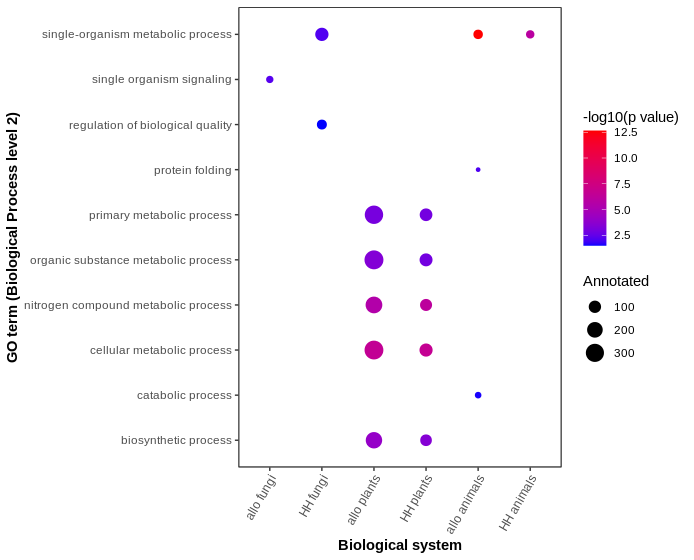
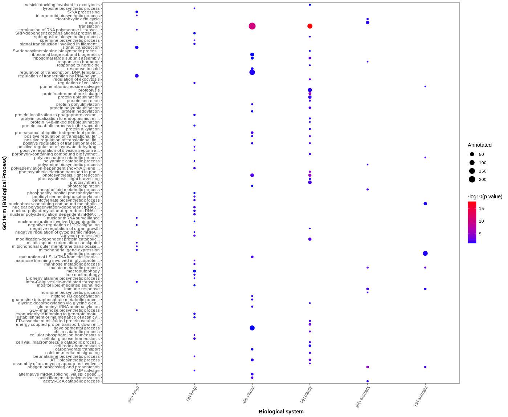

# functional_enrichment

Functional enrichment analyses can be used to identify an over-representation of biological functions in a subset of interesting genes, when compared with the entire background gene set.

In this instance, we are investigating the evolution of hybrid gene expression, so the subset of interesting genes are those with a particular expression pattern, relative to their parental species.

Briefly, the four possible categories for hybrid gene expression are:

1. **Parental expression inheritance** (PEI): any parental bias (or lack thereof) is maintained in the hybrid.
2. **Homeolog expression blending** (HEBl): a parental expression bias is lost in the hybrid.
3. **Homeolog expression bias** (HEBi): a hybrid expression bias has arisen from no parental bias.
4. **Homeolog expression reversal** (HER): an expression bias in the parents is reversed in the hybrid.

More information on these classes can be found in the following publication:

Cox, M.P., T. Dong, G. Shen, Y. Dalvi, D.B. Scott and A.R.D. Ganley. 2014. An interspecific fungal hybrid reveals cross-kingdom rules for allopolyploid gene expression patterns. *PLoS Genetics* 10: e1004180. [https://doi.org/10.1371/journal.pgen.1004180](https://journals.plos.org/plosgenetics/article?id=10.1371/journal.pgen.1004180)

## Description

The following code utilises two routes of gene ontology (GO) functional enrichment analysis: [DAVID bioinformatics resource](https://david.ncifcrf.gov/summary.jsp "DAVID") and [topGO](https://bioconductor.org/packages/release/bioc/vignettes/topGO/inst/doc/topGO.pdf "topGO").

### DAVID 

DAVID is an online tool that can perform functional annotation and functional enrichment analyses. It requires the user to submit a gene list with particular sequence identifiers, and gives the user the possibility of submitting a background gene list, or using the species background provided by the DAVID knowledgebase. Species must be present in the DAVID knowledgebase for usage of the tool.

Results of the enrichment analyses can then be downloaded as `.txt` files.  
DAVID enables GO enrichment analyses at specific GO levels (1-5). 

### topGO

topGO is an R package that can perform GO term enrichment analysis on functionally-annotated genes. Unlike DAVID, the topGO GO enrichment analyses are level-independent.

## Installation

To install the required scripts, first clone the **functional_enrichment** repository.
```
git clone https://github.com/annabehling/functional_enrichment
```

## Processing of raw DAVID functional enrichment analysis results

### Prerequisites

As DAVID functional enrichment analyses are performed through 'pointy-clicky' methods online, the following functions encompass the processing of raw DAVID output files.

To run the functions found in the file `DAVID_functions.R`, you will need a directory containing raw GO enrichment tables, downloaded from the DAVID bioinformatics resource.

Example files from a DAVID GO term enrichment analysis of homeolog expression bias (HEBi) genes can be found in `files/DAVID_HEBi`.

### Usage

First load the functions:
```{r}
source("DAVID_functions.R")
```

To read in and filter all of the example enrichment tables, applying a *p* value threshold of 0.05, run:
```{r}
allo_f_hebi_david <- read_david_go("./files/DAVID_HEBi/allo_fungi") #allopolyploid fungi
hh_f_hebi_david <- read_david_go("./files/DAVID_HEBi/HH_fungi") #homoploid hybrid fungi
allo_p_hebi_david <- read_david_go("./files/DAVID_HEBi/allo_plants") #allopolyploid plants
hh_p_hebi_david <- read_david_go("./files/DAVID_HEBi/HH_plants") #homoploid hybrid plants
allo_a_hebi_david <- read_david_go("./files/DAVID_HEBi/allo_animals") #allopolyploid animals
hh_a_hebi_david <- read_david_go("./files/DAVID_HEBi/HH_animals") #homoploid hybrid animals
```

We then can check that all data files are present; we expect there to be 15 tables (level 1-5 in the three GO ontologies) x 6 biological systems = 90 data tables total.  
Even if some are empty, it is important that the total number of files are present so that the `go_cat` argument of the following plotting argument is accurate.
```{r}
length(c(allo_f_hebi_david, hh_f_hebi_david, allo_p_hebi_david, hh_p_hebi_david, allo_a_hebi_david, hh_a_hebi_david)) #90
```

The plotting code also assumes that the raw enrichment file names meet a number of criteria as in the example file names, in order for the plotting function to be accurate.
Specifically, file names must contain:
* the character string **goterm**
* a reference to the GO ontology, either abbreviated (e.g. **bp**), or in full (e.g. **biological process**) - as a primary means of indexing the file names
* a reference to the GO level (e.g. **1 - 5**) - as a secondary means of indexing the file names

The `go_cat` argument accepts a number from 1-15, reflecting the alphabetical ordering of the file names:
* **1-5** : biological process, level 1-5
* **6-10** : cellular component, level 1-5
* **11-15** : molecular function, level 1-5

To plot the cross-kingdom results of the functional enrichment analysis of HEBi genes in the biological process ontology, level 2, run:
```{r}
GO_scatter(allo_f_hebi_david, hh_f_hebi_david, allo_p_hebi_david, hh_p_hebi_david, allo_a_hebi_david, hh_a_hebi_david, go_cat = 2, 
           y_label = "GO term (Biological Process level 2)")
```

The output should of these functions should match the following plot, which can also be found as an example output file in `files/DAVID_BP_2.png`.

  
The plot shows no common enriched GO terms at biological process level 2.

Alternatively, to see if there are any common GO terms across any GO ontology level, run:
```{r}
mapply(FUN = common_terms, allo_f_hebi_david, hh_f_hebi_david, allo_p_hebi_david, hh_p_hebi_david, allo_a_hebi_david, hh_a_hebi_david, SIMPLIFY = FALSE)
```

## topGO functional enrichment analysis and processing

### Prerequisites

As topGO functional enrichment analyses are performed in R, the following functions encompass both the running of functional enrichment analyses and the processing of those results.

To run the functions found in the file `topGO_functions.R`, you will need two input files:

1. A dataframe with at least two columns
  * One column containing all gene IDs that have a non-NA expression category classification
  * One column (named 'classification') containing the expression classification for each gene

More information on how this classification dataframe can be made from raw read count data can be found in [this repository](https://github.com/annabehling/DEA_and_fit "github.com/annabehling/DEA_and_fit").

2. A file with GO term annotations for each gene (e.g. from [Pannzer2](http://ekhidna2.biocenter.helsinki.fi/sanspanz/ "Pannzer") or [Ensembl Biomart](https://www.ensembl.org/biomart/martview/9411b747344f748c4cc79534aa27827c "Biomart")).

Examples of these input files can be found in `files/topGO_input`.

### Usage

First load the functions:
```{r}
source("topGO_functions.R")
```

In this example we will use a homoploid hybrid (HH) plant Pannzer2 output file for GO annotations.
(See `topGO_functions.R` for an analogous function for working with Biomart annotation data.)
```{r}
go_anno <- read.table("files/topGO_input/pannzer_go_anno.out", 
	quote='"', sep="\t", header=TRUE, colClasses = c("goid"="character", "qpid"="character"))
```

Process the GO annotation file:
```{r}
go_anno_filt <- go_anno[(go_anno$ARGOT_PPV > 0.5), ] #filter for reliable annotations
go_anno_filt$goid <- paste0("GO:", go_anno_filt$goid) #paste "GO:" to beginning of each GO ID
```

Read in the classification dataframe:
```{r}
sub_classes_df <- read.table("files/topGO_input/sub_classes_df.txt", header = TRUE)
```

Ensure that the format of the HH plant `sub_classes_df$$gene_id` matches the HH plant `go_anno_filt$qpid`:
```
go_anno_filt$qpid <- str_replace(go_anno_filt$qpid, "prot", "cds")
```

Make a list of background genes with GO annotations, in **gene2GO** format:  
  * Zero, one or many GO IDs are annotated to each gene
```{r}
gene2go_list <- pannzer_to_golist(go_anno_filt)
```

Make a sub-gene2GO list containing only genes with a non-NA expression classification:
```{r}
sub_gene2go <- gene2go_list[sub_classes_df$gene_id]
```

Make a character vector of all gene IDs that have a non-NA expression classification:
```{r}
gene_names <- names(sub_gene2go) 
```

To get the lists of interesting genes in the HEBl, HEBi and HER, run:
```{r}
int_genes <- get_int_genes(sub_classes_df, gene_names)
```
We won't perform an enrichment analysis of the PEI category, due to the high number of genes that are classified as PEI; it is difficult to test for enrichment when the subset of genes comprises the majority of the background.

We can index the list to separate out the interesting genes in each of the categories, where:
* `int_genes[[1]]` : HEBl genes  
* `int_genes[[2]]` : HEBi genes  
* `int_genes[[3]]` : HER genes  

Then, run the enrichment analyses in all ontologies with the indexed list of interesting genes as the foreground and the sub-gene2GO list as the background:
```{r}
hebl_topgo <- all_enriched(int_genes[[1]], sub_gene2go)
hebi_topgo <- all_enriched(int_genes[[2]], sub_gene2go)
her_topgo <- all_enriched(int_genes[[3]], sub_gene2go)
```

We can then run the above analyses on all six of our hybrid species (the following example outputs of which are all available in `files/topGO_output`).
* `allo_a_hebi_topgo.txt` : allopolyploid animals HEBi
* `allo_a_hebl_topgo.txt` : allopolyploid animals HEBl
* `allo_a_her_topgo.txt` : allopolyploid animals HER
* `allo_f_hebi_topgo.txt` : allopolyploid fungi HEBi
* `allo_f_hebl_topgo.txt` : allopolyploid fungi HEBl
* `allo_f_her_topgo.txt` : allopolyploid fungi HER
* `allo_p_hebi_topgo.txt` : allopolyploid plants HEBi
* `allo_p_hebl_topgo.txt` : allopolyploid plants HEBl
* `allo_p_her_topgo.txt` : allopolyploid plants HER
* `hh_a_hebi_topgo.txt` : homoploid hybrid animals HEBi
* `hh_a_hebl_topgo.txt` : homoploid hybrid animals HEBl
* `hh_a_her_topgo.txt` : homoploid hybrid animals HER
* `hh_f_hebi_topgo.txt` : homoploid hybrid fungi HEBi
* `hh_f_hebl_topgo.txt` : homoploid hybrid fungi HEBl
* `hh_f_her_topgo.txt` : homoploid hybrid fungi HER
* `hh_p_hebi_topgo.txt` : homoploid hybrid plants HEBi
* `hh_p_hebl_topgo.txt` : homoploid hybrid plants HEBl
* `hh_p_her_topgo.txt` : homoploid hybrid plants HER

Read in the example output files using, e.g.
```{r}
hh_p_hebi_topgo <- read.table("files/topGO_output/hh_p_hebi_topgo.txt", header = TRUE, sep = "\t")
```

Then, to make a scatter plot to compare functional enrichment of a particular expression classification across all hybrid species, run:
```{r}
topGO_scatter(allo_f_hebi_topgo[allo_f_hebi_topgo$ontology == "BP", ],
              hh_f_hebi_topgo[hh_f_hebi_topgo$ontology == "BP", ],
              allo_p_hebi_topgo[allo_p_hebi_topgo$ontology == "BP", ],
              hh_p_hebi_topgo[hh_p_hebi_topgo$ontology == "BP", ],
              allo_a_hebi_topgo[allo_a_hebi_topgo$ontology == "BP", ],
              hh_a_hebi_topgo[hh_a_hebi_topgo$ontology == "BP", ], 
              y_label = "GO term (Biological Process)")
```

In this example code, we have plotted enrichment of biological process, in the HEBi category.
The output should of these functions should match the following plot, which can also be found as an example output file in `files/topGO_BP.png`.



As mentioned above, topGO performs level-independent functional enrichment of GO terms, which makes the y axis of this plot far more populated (with enriched GO terms from all levels) than the DAVID plot. Consequently, this topGO plot is less effective at comparing cross-kingdom enriched GO terms, however, it does appear to have reached the same conclusion as the DAVID results: no GO terms common to every system.

## Acknoledgements

Thank you to [David Winter](https://github.com/dwinter "github.com/dwinter") for the `pannzer_to_golist()` code.